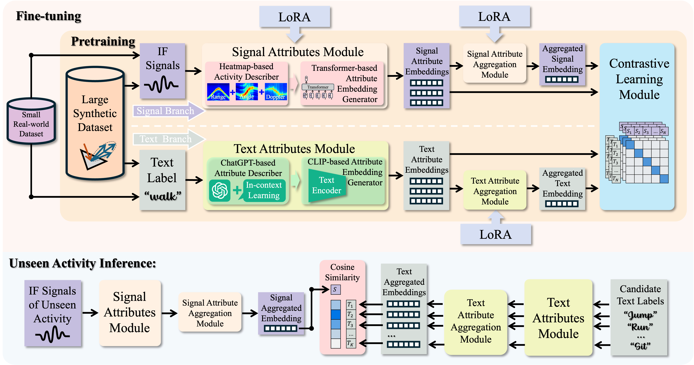

## mmCLIP: Boosting mmWave-based Zero-shot HAR via Signal-Text Alignment
Implementation for the SenSys24 paper **_mmCLIP: Boosting mmWave-based Zero-shot HAR via Signal-Text Alignment_**.

Currently, we provide the deep learning model code and preprocessed synthetic dataset.



### Requirements
conda create -n mmCLIP python=3.8.17

pip install torch==2.0.1 torchvision==0.15.2 torchaudio==2.0.2

pip install matplotlib

pip install transformers==4.36.0

pip install git+https://github.com/openai/CLIP.git

pip install timm==0.9.12

pip install opencv-python

pip install pandas

pip install scikit-learn

### Dataset Download
Please download the preprocessed synthetic signal dataset and LLM-augmented text descriptions from the following link:

https://purdue0-my.sharepoint.com/:f:/g/personal/cao393_purdue_edu/ElON7JfgsTRMuzxap8Kv6j4B4qeGC2qTndGjOvX5FJEdBw?e=ILTOFv

### Pretrain with Synthetic Dataset
**To pretrain model on synthetic dataset, run**

``python src/train_babel_gpt_v2.py``

### Fine-tune with Local data
**Run Zero-shot mmCLIP with synthetic data pretraining:**

``python src/train_zs_real_finetune.py ``

Note that iteration 0 will be mmCLIP-Syn-Attr.

**Run mmCLIP without synthetic data pretraining:**

``python src/train_zs_real_only.py ``

**Run One-shot mmCLIP with synthetic data pretraining:**

``python src/train_zs_real_fewshot.py ``

If you find anything useful in our project, please consider citing our paper.

```
@inproceedings{cao2024mmclip,
  title={mmCLIP: Boosting mmWave-based Zero-shot HAR via Signal-Text Alignment},
  author={Cao, Qiming and Xue, Hongfei and Liu, Tianci and Wang, Xingchen and Wang, Haoyu and Zhang, Xincheng and Su, Lu},
  booktitle={Proceedings of the 22nd ACM Conference on Embedded Networked Sensor Systems},
  pages={184--197},
  year={2024}
}
```